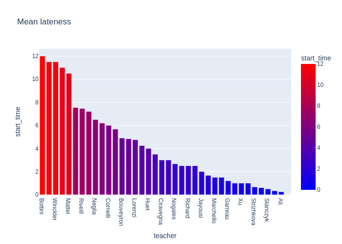
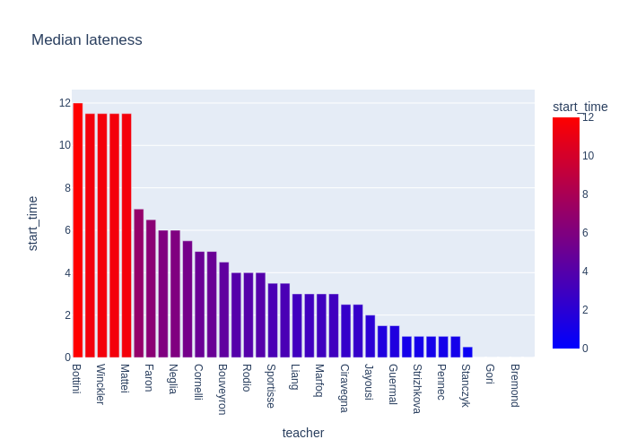
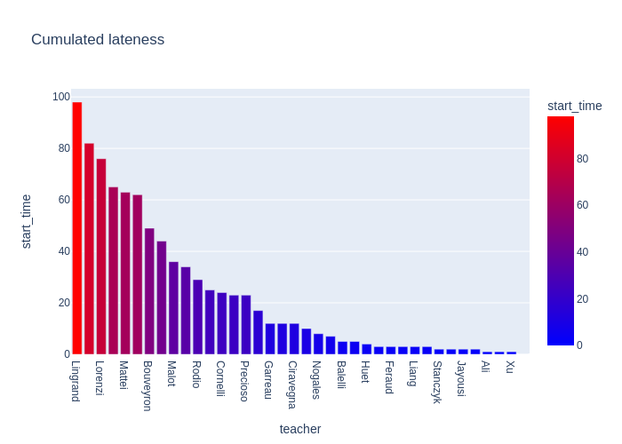

<!-- START doctoc generated TOC please keep comment here to allow auto update -->
<!-- DON'T EDIT THIS SECTION, INSTEAD RE-RUN doctoc TO UPDATE -->
**Table of Contents**  *generated with [DocToc](https://github.com/thlorenz/doctoc)*

- [Lateness](#lateness)
  - [Mean lateness](#mean-lateness)
  - [Median lateness](#median-lateness)
  - [Sum lateness](#sum-lateness)

<!-- END doctoc generated TOC please keep comment here to allow auto update -->

# Lateness
Here is a documentation of the time at which teachers start their classes.

## Mean lateness

## Median lateness

## Sum lateness

